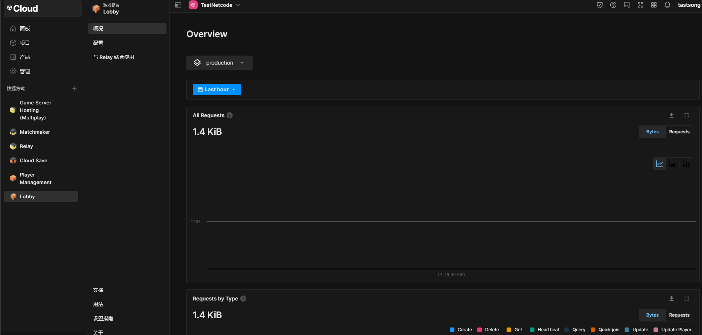

# 全栈架构推荐

# 零、序

在迅猛发展的游戏行业，精良的网络游戏架构是确保游戏顺畅运行和提供无缝玩家体验的关键要素。本文深入剖析游戏端、后端和服务端的各个层面，为游戏开发者提供了一个全面的视角，助力他们在设计过程中做出明智的决策。

**游戏端:** 我们将深入探讨Unity引擎下的游戏端，介绍**DOTS（ECS）**的强大性能优化，以及**GameFramework**、**ET**、**QFramework**等框架的独特特点。这将为开发者提供在构建游戏时选择最适合框架的依据。

**后台:** 在后台方面，我们将讨论**Pure Admin**和**VUE Element Admin**等后台框架，探索它们在开发中的便利性、灵活性以及与游戏前端的协同工作。

**服务端:** 对于服务端，我们将详细解释为何选择**Laravel**和**Spring Boot**等作为Web服务器，探讨它们在开发速度、性能和生态系统方面的优劣。同时，我们将深入研究**Skynet**和**Rock GO**游戏服务器的特性，帮助开发者了解它们在构建游戏服务器时的独特优势。

这篇文章将为游戏开发者提供深度洞察，使他们能够在项目中选择最适合的架构，实现高性能、高扩展性和令人印象深刻的游戏体验。随着技术的不断演进，我们将探索如何利用先进的网络游戏架构来塑造游戏行业的未来。

# 一、游戏端

## 1.1 DOTS（ECS）

### 1.1.1 原理分析

1. **DOTS概述：** DOTS（Data-Oriented Tech Stack）是一个多线程数据导向型技术堆栈，包含ECS（Entity Component System）、C# Job System和Burst Compiler。它通过ECS实现缓存友好、利用Job System进行多线程高效运算，再由Burst Compiler生成高度优化的本地代码。
2. **ECS原理：** ECS的核心是缓存友好的设计，利用结构体去掉垃圾回收。它通过将相同类型的组件在内存中排列在一起，利用Chunk和Archetype来提高数据访问效率。
3. **Job System原理：** Job System是用于编写高性能多线程代码的组件，充分利用多线程，提高运算效率。
4. **Burst Compiler：** Burst Compiler基于LLVM开发，利用SIMD指令优化，特别适用于大规模数学计算，如矩阵运算，提高运算速度。
5. **Hybrid Renderer：** Hybrid Renderer是为了适配ECS而开发的渲染系统，尽管在动画系统和蒙皮动画方面还存在一些限制，但在特定场景下能提供高效渲染。

### 1.1.2 应用

[Unity DOTS](https://github.com/Unity-Technologies/DOTS-training-samples)是一个官方的项目示例，该示例项目提供了一系列基于DOTS的训练样本，旨在帮助开发者学习和实践DOTS的使用。通过这些样本，你可以深入了解DOTS在不同场景下的应用，包括但不限于物理模拟、动画系统、多线程处理等。

*注意一定要使用对用版本的Unity打开，DOTS处于不断的迭代和发展之中，对应的Unity版本和依赖版本相对较为严格。*

### 1.1.3 优缺点

| 优势                                                         | 缺点                                                         |
| ------------------------------------------------------------ | ------------------------------------------------------------ |
| **卓越性能：** 通过ECS和Job System等组件，DOTS提供出色的性能，尤其在处理大规模数据时。 | **学习曲线：** 对于新手来说，学习DOTS可能需要一定的时间，尤其是理解ECS的概念和使用Job System等组件。 |
| **多线程优化：** Job System使得多线程编程变得更加容易，提高了游戏的并行处理能力。 | **渲染限制：** 在Hybrid Renderer中，对于动画和蒙皮动画的支持仍然不够完善，可能需要在某些方面使用传统渲染。 |
| **Burst Compiler优化：** 使用Burst Compiler生成高度优化的本地代码，提高运行效率。 | **不适用于所有项目：** DOTS更适用于大规模相同单位运算的项目，对于一些简单游戏而言，引入DOTS可能显得过于复杂。 |
| **适用于数学计算：** DOTS通过SIMD指令优化数学运算，特别适用于处理大规模数学计算。 | **版本迭代：** DOTS在不断迭代中，可能会导致接口和功能的变动，需要保持关注最新版本。 |

### 1.1.4 适用场景

1. 大规模相同物体的运算

   DOTS在处理大量相同物体的运算时展现出色的性能。对于类似红警等战略游戏，可能存在大量相同类型的单位或建筑，这些单位需要进行雷同运算，如移动、攻击等。DOTS通过其缓存友好的设计和多线程优化，能够高效地处理这些大规模的运算，从而提供卓越的性能。

2. 学习成本高但值得投入

   尽管DOTS的学习曲线相对较高，但在特定项目中，尤其是在需要处理大规模数据和实现高性能的场景下，对其进行投入可能是值得的。在类似战略游戏的复杂性和性能需求下，通过理解和使用DOTS，开发者能够获得更高效、更可维护的代码结构。

3. 已有项目不建议升级

   对于已经成型的项目，特别是那些不具备大规模相同物体运算需求的项目，引入DOTS可能并不切实际。由于DOTS仍在不断迭代，项目升级到DOTS可能导致较高的迁移成本，并且并非所有项目都能从DOTS中获得显著的性能提升。因此，在项目已经成熟的情况下，不建议升级到DOTS。

4. 独立开发

   DOTS（Data-Oriented Tech Stack）在特定情境下，尤其是独立开发者考虑使用Unity的云服务代理Netcode时，也是一个极具吸引力的选择。Unity的Netcode是一个用于构建多人联网游戏的云服务代理，它旨在简化多人游戏的开发和部署。当你的游戏需要支持多人联机，并且你计划使用Unity的Netcode服务时，DOTS可以作为一个优秀的游戏端框架。

## 1.2 GameFramework

### 1.2 .1 框架概述

[GameFramework](https://github.com/EllanJiang/GameFramework)是一个开源的Unity游戏开发框架，旨在帮助开发者更高效地构建游戏项目。该框架提供了一系列功能模块，包括事件管理、资源加载、对象池、流程管理等，以简化游戏开发中常见的任务，使开发者能够更专注于游戏逻辑的实现。

### 1.2 .2 主要功能和原理

1. **模块化设计：** GameFramework采用模块化设计，将不同功能划分为独立的模块，如事件管理、资源加载等。这种设计使得开发者能够根据项目需求选择性地使用框架提供的功能，提高了框架的灵活性。
2. **事件管理：** 提供了事件系统，用于处理游戏中各种事件的发布和监听。通过事件管理，开发者能够实现不同模块之间的松耦合通信，增强代码的可维护性。
3. **资源加载：** GameFramework包含了资源加载模块，用于管理和加载游戏中的各类资源。通过资源加载模块，开发者可以方便地进行资源加载和卸载，提高游戏的性能和效率。
4. **对象池：** 提供了对象池功能，用于管理游戏中的对象实例，以减少对象的创建和销毁开销。对象池能够有效地重用对象，提高游戏性能。
5. **流程管理：** GameFramework引入了流程管理的概念，用于管理游戏的各个阶段或状态。通过流程管理，开发者可以更容易地组织游戏的逻辑结构，实现游戏状态的切换和管理。

### 1.2 .3 优缺点

| 优势                                                         | 缺点                                                         |
| ------------------------------------------------------------ | ------------------------------------------------------------ |
| **模块化设计：** 框架采用模块化设计，使得开发者能够根据项目需求选择性地使用不同功能模块，提高了框架的灵活性。 | **社区活跃度：** 相对于一些主流游戏框架，GameFramework的社区活跃度可能较低，可能导致获取支持和解决问题的速度较慢。 |
| **事件管理：** 提供了事件系统，有助于实现模块之间的解耦通信，增强了代码的可维护性。 | **学习曲线：** 对于新手来说，框架的学习曲线可能较陡峭，需要花一定时间熟悉和掌握框架的各个模块。 |
| **资源加载：** 拥有资源加载模块，方便管理和加载游戏中的各类资源，提高了游戏的性能和效率。 | **框架规模：** 相较于一些大型游戏引擎提供的完整解决方案，GameFramework的功能可能相对有限，适用于一些中小型项目。 |
| **对象池：** 提供了对象池功能，能够有效地重用对象，降低对象创建和销毁的性能开销。 | **文档完整性：** 框架的文档可能相对较少，可能需要依赖源码和示例项目进行更深入的了解。 |
| **流程管理：** 引入了流程管理的概念，有助于更容易地组织游戏的逻辑结构，实现游戏状态的切换和管理。 |                                                              |

### 1.2 .4 适用场景

GameFramework适用于中小型游戏项目，特别是那些对框架模块化设计、事件管理、资源加载和对象池等功能有需求的项目。以下是适用场景的一些示例：

1. **小型独立开发项目：** 对于小型独立开发者，GameFramework提供了一套相对完整的框架，能够帮助项目更快速地搭建起来。
2. **中小型团队开发：** 适用于中小型团队开发的项目，框架提供的模块化设计和流程管理有助于团队更好地协作。
3. **有一定经验的开发者：** 针对有一定游戏开发经验的开发者，学习和使用GameFramework能够提高项目的开发效率。

总的来说，GameFramework作为一个轻量级的Unity游戏开发框架，适用于一些对框架功能需求较为简单的中小型项目。

##  1.3  ET 

### 1.3.1 框架概述

[ET](https://github.com/egametang/ET)是一款基于C#语言开发的游戏服务器框架，旨在简化多人在线游戏的开发。ET框架采用Entity-Component-System（ECS）架构，具有热更支持、Actor模型和分布式服务器等特性。

### 1.3.2 主要功能和原理

1. **Entity-Component-System（ECS）架构：** ET框架采用ECS架构，将游戏对象分解成实体（Entity）和组件（Component），并通过系统（System）管理它们的行为。这提高了代码的可维护性和可扩展性。
2. **热更支持：** ET支持热更功能，允许在运行时更新游戏逻辑代码，无需停服。这有助于提高游戏的运维效率和灵活性。
3. **Actor 模型：** 引入Actor模型，将每个玩家、怪物等实体都看作一个独立的Actor，通过消息传递进行通信。这简化了并发编程，减少了锁的使用。
4. **分布式服务器：** ET支持分布式部署，通过Actor模型和分布式部署，能够构建出高可用性和高性能的多人在线游戏服务器集群。

### 1.3.3 优缺点

| 优势                                                         | 缺点                                                         |
| ------------------------------------------------------------ | ------------------------------------------------------------ |
| **ECS架构：** 提高了代码的可维护性和可扩展性，使得游戏服务器逻辑更加清晰。 | **学习曲线：** 对于新手来说，理解和掌握ECS架构可能需要一定的学习成本。 |
| **热更支持：** 允许在运行时更新游戏逻辑代码，提高了游戏的运维效率。 | **社区支持：** 相对于一些主流游戏框架，ET框架的社区相对较小，可能导致获取支持的速度较慢。 |
| **Actor模型：** 简化了并发编程，减少了锁的使用，有助于处理多玩家同时操作的情况。 | **热更稳定性：** 在一些特定场景下，热更功能可能面临一些稳定性的挑战，需要谨慎使用。 |
| **分布式部署：** 能够构建出高可用性和高性能的多人在线游戏服务器集群。 | **文档完整性：** 框架的文档相对较少，可能需要依赖源码和示例项目进行更深入的了解。 |

### 1.3.4 适用场景

ET框架适用于中大型多人在线游戏项目，特别是那些对服务器性能和可维护性要求较高的项目。以下是适用场景的一些示例：

1. **多人在线游戏项目：** 由于ET框架采用了Actor模型和分布式部署，适用于构建大规模的多人在线游戏服务器。
2. **对服务器性能要求高的项目：** 采用ECS架构和Actor模型，ET框架能够有效地处理多玩家同时操作的情况，适用于对服务器性能要求较高的项目。
3. **需要热更支持的项目：** ET框架提供了热更功能，适用于需要在运行时更新游戏逻辑代码而无需停服的项目。
4. **分布式服务器集群：** 通过支持分布式部署，ET框架能够构建出高可用性和高性能的服务器集群，适用于对服务器架构要求较高的项目。

总体来说，ET框架是一个专注于多人在线游戏服务器开发的框架，适用于一些大规模和对性能要求高的游戏项目。

## 1.4  QFramework 

### 1.4.1 框架概述

[QFramework](https://github.com/liangxiegame/QFramework)是一款基于Unity引擎的开源框架，旨在提供一套简洁而强大的工具和设计模式，帮助开发者更高效地构建Unity应用。它采用了一系列的设计模式和模块，包括依赖注入、状态机、命令模式等，以提高代码的可维护性和可扩展性。

### 1.4.2 主要功能和原理

1. **设计模式集成：** QFramework集成了多种设计模式，包括但不限于依赖注入、状态机、命令模式等，以便开发者根据项目需求选择合适的模式。
2. **模块化开发：** 框架提供了一系列的模块，涵盖了UI、资源管理、事件系统等方面，使得开发者可以更加模块化地构建项目。
3. **代码生成工具：** QFramework包含代码生成工具，用于快速生成各种代码片段，提高开发效率。
4. **可扩展性：** 框架支持插件系统，允许开发者根据项目需求自定义和添加功能。

### 1.4.3  优缺点

| 优势                                                         | 缺点                                                         |
| ------------------------------------------------------------ | ------------------------------------------------------------ |
| **多设计模式支持：** 集成了多种设计模式，使得开发者可以根据项目需求选择适合的模式，提高代码质量。 | **学习曲线：** 对于初学者来说，由于集成了多种设计模式和工具，可能需要一定时间适应和掌握。 |
| **模块化开发：** 提供了一系列模块，涵盖了项目开发中常见的需求，使得项目更加模块化、可维护。 | **社区支持：** 相对于一些主流框架，QFramework的社区相对较小，可能获取支持的速度较慢。 |
| **代码生成工具：** 提供了代码生成工具，用于快速生成代码片段，提高了开发效率。 | **依赖问题：** 使用QFramework可能需要引入一系列的依赖库，可能会涉及到版本兼容性和依赖冲突。 |
| **可扩展性：** 支持插件系统，允许开发者根据项目需求自定义和添加功能，提供了一定的灵活性。 |                                                              |

### 1.4.4 适用场景

QFramework适用于一些中大型Unity项目，特别是那些对代码结构和可维护性要求较高的项目。以下是适用场景的一些示例：

1. **多设计模式需求：** 项目对多种设计模式的需求较高，需要根据不同场景选择适合的设计模式。
2. **模块化需求：** 项目较为庞大，需要采用模块化开发，将各个功能划分为独立的模块，提高代码可维护性。
3. **定制功能需求：** 项目对功能有一定的定制需求，需要使用框架提供的插件系统进行功能定制。
4. **提高开发效率：** 项目对开发效率有一定要求，可以利用QFramework提供的代码生成工具加速开发。

总体而言，QFramework是一个专注于设计模式和模块化开发的框架，适用于中大型Unity项目，尤其对于具有一定定制需求的项目。由于其优秀的设计模式和高扩展性，我选择在其基础上进行了 [CrazyCar](https://github.com/TastSong/CrazyCar) 项目的优化。

## 1.5 总结

横向对比如下：

| 特性/框架  | DOTS（ECS）                               | ET                                   | GameFramework                              | QFramework                                 |
| ---------- | ----------------------------------------- | ------------------------------------ | ------------------------------------------ | ------------------------------------------ |
| 设计理念   | 数据导向、多线程优化、高性能              | 游戏服务器框架(全栈式开发)           | 游戏开发全流程框架                         | 模块化设计、提供设计模式、代码生成工具     |
| 主要组成   | ECS、C# Job System、Burst Compiler        | Actor模型、消息机制、组件系统        | 模块化框架、提供游戏开发全流程的各种模块   | 模块化框架、设计模式、代码生成工具         |
| 优势       | 卓越性能、多线程优化、Burst Compiler优化  | 网络通信模块、分布式节点、逻辑热更   | 提供全面的游戏开发流程、易用性、社区庞大   | 多设计模式支持、模块化开发、代码生成工具   |
| 缺点       | 学习曲线较高、渲染限制（Hybrid Renderer） | 学习曲线相对较高                     | 可能显得过于庞大、社区支持相对较小         | 学习曲线相对较高，需要理解作者的设计理念   |
| 适用场景   | 大规模相同物体运算、高性能需求的游戏项目  | 多人联网游戏、分布式服务器、逻辑热更 | 各类游戏项目、尤其是小型至中型项目         | 中大型项目、多设计模式需求、模块化开发需求 |
| 特殊关注点 | 高性能、多线程优化、大规模数据处理        | 多人联网、分布式节点、逻辑热更       | 游戏流程管理、易用性、开发效率、社区活跃度 | 模块化设计、可扩展性、代码生成工具         |
| 社区活跃度 | 相对活跃                                  | 相对活跃                             | 非常活跃                                   | 相对较小，但仍有一定活跃度                 |
| 可扩展性   | 中                                        | 中                                   | 高                                         | 高                                         |
| 开发效率   | 低                                        | 高                                   | 高                                         | 高                                         |

上表对DOTS（ECS）、ET、GameFramework、QFramework进行了横向对比，以帮助了解它们的主要特性、优缺点、适用场景和一些特殊关注点。实际选择框架应根据项目需求、开发团队熟悉度和项目规模等因素进行综合考虑；除了DOTS（ECS）、ET、GameFramework、QFramework之外，还有一些其他不错的框架：

1. [JEngine](https://github.com/JasonXuDeveloper/JEngine)是一个轻量级的基于Unity的游戏框架，致力于提供简洁高效的开发体验。
2. [TEngine](https://github.com/ALEXTANGXIAO/TEngine)是一个基于Unity的游戏开发框架，提供一系列工具和功能，旨在提高开发效率。
3. [IFramework](https://github.com/OnClick9927/IFramework)是一个Unity框架，旨在提供清晰简洁的代码结构和工具，方便开发者进行Unity项目开发。

这些框架在各自的领域都有一定的优势，可以根据项目需求和开发者的偏好进行选择。

# 二、后台

## 2.1  vue-element-admin 框架分析

### 2.1.1 框架概述

[vue-element-admin](https://github.com/PanJiaChen/vue-element-admin) 是一个基于 Vue.js 和 Element UI 的后台管理系统框架。它提供了丰富的组件和功能，用于快速搭建现代化的管理后台。该框架的目标是使开发者能够轻松构建功能强大、美观的管理系统。

### 2.1.2 主要功能和原理

- **Vue.js 和 Element UI：** `vue-element-admin`基于 Vue.js 框架，结合 Element UI 组件库，提供了丰富的可复用组件，简化了管理系统的开发。
- **组件化开发：** 使用 Vue.js 的组件化开发思想，使得代码结构清晰、可维护性强。
- **权限管理：** 支持灵活的权限管理系统，开发者可以根据用户角色进行权限控制，确保系统安全性。
- **路由管理：** 基于 Vue Router 实现了灵活的路由管理，支持多级嵌套路由和动态路由配置。
- **状态管理：** 使用 Vuex 进行状态管理，方便统一管理组件间的状态。

### 2.1.3  优缺点

| 优势                                                         | 缺点                                                         |
| ------------------------------------------------------------ | ------------------------------------------------------------ |
| **丰富的组件和功能：**提供了大量现成的组件和功能，加速管理系统的开发。 | **学习曲线：** 对于初学者，Vue.js 和 Element UI 的学习曲线可能较陡。 |
| **组件化开发：**采用 Vue.js 的组件化开发思想，代码结构清晰、可维护性强。 | **定制性限制：**某些情况下，框架可能不够灵活，定制性受到一定限制。 |
| **权限管理：**支持灵活的权限管理系统，确保系统安全性。       | **版本更新：**框架的版本更新可能导致部分代码需要调整。       |
| **路由管理：**基于 Vue Router 实现了灵活的路由管理。         | **适用范围：**更适用于后台管理系统，不太适用于其他类型的应用。 |
| **状态管理：**使用 Vuex 进行状态管理，方便统一管理组件间的状态。 |                                                              |

### 2.1.4  适用场景

`vue-element-admin` 适用于构建现代化的后台管理系统，特别是对于需要以下特性的项目：

1. **丰富的组件和功能：** 适用于需要大量现成组件和功能的项目，能够加速管理系统的开发。
2. **权限管理需求：** 适用于有复杂权限管理需求的项目，可以根据用户角色进行权限控制。
3. **Vue.js 和 Element UI 用户：** 适用于已经熟悉 Vue.js 和 Element UI 的开发者，能够更好地发挥框架的优势。
4. **后台管理系统：** 更适用于后台管理系统的开发，提供了路由管理、状态管理等支持。

总体而言，`vue-element-admin` 是一个面向后台管理系统的 Vue.js 框架，适用于需要快速构建现代化管理系统的开发者。

## 2.2 vue-vben-admin 框架分析

### 2.2.1 框架概述

[vue-vben-admin](https://github.com/vbenjs/vue-vben-admin) 是基于 Vue 3.x 和 Vite 2.x 的后台管理系统框架。它提供了一套完整的解决方案，旨在帮助开发者更轻松地构建现代化、灵活的管理系统。

### 2.2.2 主要功能和原理

- **Vue 3.x 和 Vite 2.x：** 采用最新的 Vue 3.x 版本和 Vite 2.x 构建工具，保证了性能和开发体验。
- **Vben Admin 插件：** 框架内置 Vben Admin 插件，提供了一系列的模块、组件和工具，方便开发者快速搭建后台管理系统。
- **权限管理和路由控制：** 支持灵活的权限管理系统和路由控制，使得开发者能够根据业务需求进行定制。
- **国际化支持：** 内置国际化支持，方便实现多语言管理系统。
- **模块化开发：** 采用模块化开发方式，使得系统更易维护、扩展。

### 2.2.3优缺点

| 优势                                                         | 缺点                                                         |
| ------------------------------------------------------------ | ------------------------------------------------------------ |
| **基于 Vue 3.x 和 Vite 2.x：**采用最新版本的 Vue 和 Vite，保证了性能和开发体验。 | **学习曲线：** 对于初学者，Vue 3.x 和 Vite 2.x 的新特性可能需要一定时间适应。 |
| **Vben Admin 插件：**内置 Vben Admin 插件，提供了丰富的模块和组件，加速了开发进程。 | **相对新框架：** 作为相对新的框架，可能在社区支持和文档完善方面略显不足。 |
| **权限管理和路由控制：**支持灵活的权限管理和路由控制，适应不同业务场景。 | **版本更新：**由于是较新的框架，可能会面临版本更新导致的一些调整。 |
| **国际化支持：**内置国际化支持，方便构建多语言管理系统。     | **生态相对较小：**相对于一些主流框架，生态相对较小，可能需要自行实现一些功能。 |
| **模块化开发：**采用模块化开发方式，使得系统更易维护、扩展。 |                                                              |

### 2.2.4 适用场景

`vue-vben-admin` 适用于构建现代化、灵活的后台管理系统，特别适用于以下场景：

1. **基于最新技术栈：** 适用于希望使用 Vue 3.x 和 Vite 2.x 构建管理系统的开发者，追求最新技术栈。
2. **快速开发需求：** 内置 Vben Admin 插件，提供了一系列的模块和组件，适用于对开发速度有一定要求的项目。
3. **权限和路由定制需求：** 支持灵活的权限管理和路由控制，适应不同业务场景，适用于需要高度定制的项目。
4. **模块化开发：** 采用模块化开发方式，使得系统更易维护、扩展，适用于需要不断扩展功能的项目。

总体而言，`vue-vben-admin` 是一个基于最新 Vue 技术栈的后台管理系统框架，适用于追求新技术和灵活性的开发者。

## 2.3 总结

横向对比：vue-element-admin 与 vue-vben-admin

| **特征**                 | **vue-element-admin**                               | **vue-vben-admin**                                |
| ------------------------ | --------------------------------------------------- | ------------------------------------------------- |
| **基础框架**             | Vue 2.x                                             | Vue 3.x, Vite 2.x                                 |
| **开发工具**             | Vue CLI                                             | Vite (Next-generation frontend tooling)           |
| **UI 组件库**            | Element UI                                          | Vben Admin 插件（自带一系列模块和组件）           |
| **权限管理**             | 有权限管理系统，支持配置路由权限，但是做的比较简单  | 支持灵活的权限管理和路由控制                      |
| **国际化**               | 内置多语言支持，支持切换语言                        | 内置国际化支持，方便构建多语言管理系统            |
| **技术栈**               | 使用 Vue 2.x，Webpack 构建                          | 使用 Vue 3.x，Vite 2.x 构建                       |
| **模块化开发**           | 支持模块化开发，但相对 vue-vben-admin 较为传统      | 采用模块化开发方式，使得系统更易维护、扩展        |
| **社区支持与文档完善度** | 相对较大，有丰富的社区支持和文档                    | 相对较新，社区支持相对较小，文档可能较少          |
| **生态与插件**           | 成熟的插件和生态系统，例如 Element UI 等            | Vben Admin 插件提供了一系列模块和组件             |
| **适用场景**             | 适用于传统的 Vue 2.x 项目，对社区支持要求较高的项目 | 适用于基于 Vue 3.x 和 Vite 2.x 的现代管理系统项目 |

`vue-element-admin` 的社区更活跃一点。如果只涉及简单的后台服务，没有强烈的菜单和权限功能需求，建议使用 `vue-element-admin`。但若有菜单和权限功能的需求，推荐使用 `vue-vben-admin`。同时，也可以考虑结合我的开源项目 [CrazyCar](https://github.com/TastSong/CrazyCar)，在 `vue-element-admin` 的基础上进行一些修改。

# 三、服务端

## 3.1 Laravel

Laravel是一款流行的PHP Web应用程序框架，具有优雅的语法和强大的功能。以下是关于Laravel的概述、主要功能和原理、优缺点以及适用场景的详细信息。

### 3.1.1 框架概述

[Laravel](https://github.com/laravel/laravel)是一款免费的开源PHP框架。它通过提供优雅的语法和强大的工具，简化了PHP应用程序的开发过程。Laravel采用MVC（模型-视图-控制器）架构，提供了丰富的功能，如路由、ORM（对象关系映射）、模板引擎等。

### 3.1.2 主要功能和原理

1. **MVC架构：** Laravel采用MVC架构，将应用程序分为模型、视图和控制器。这种分层结构使代码更加模块化和可维护。
2. **Artisan命令行工具：** Laravel提供了强大的命令行工具Artisan，用于执行常见任务，如数据库迁移、任务调度等。
3. **Eloquent ORM：** Eloquent是Laravel的ORM工具，简化了数据库操作。它允许开发者通过PHP代码进行数据库查询和操作，而不必直接使用SQL语句。
4. **Blade模板引擎：** Laravel使用Blade模板引擎，提供了简洁而强大的模板语法，使得视图的创建和管理更加便捷。

### 3.1.3 优缺点

| 优势                                                         | 缺点                                                         |
| ------------------------------------------------------------ | ------------------------------------------------------------ |
| **优雅的语法：** Laravel具有清晰、简洁且优雅的语法，使得开发者能够更容易理解和编写代码。 | **学习曲线：** 对于初学者来说，Laravel的学习曲线可能较陡峭，特别是对于那些没有PHP框架经验的开发者。 |
| **强大的工具：** 提供了丰富的工具和组件，如Artisan命令行工具、Eloquent ORM等，提高了开发效率。 | **性能限制：** 相较于一些轻量级框架，Laravel在处理大规模请求时可能面临一些性能限制。 |
| **MVC架构：** 采用MVC架构，使得应用程序的结构更加清晰，方便模块化开发和维护。 | **过度抽象：** 有些开发者认为Laravel在某些情况下过度抽象，可能导致性能损失。 |
| **生态系统：** 拥有庞大的生态系统和活跃的社区，提供了丰富的扩展包和文档。 |                                                              |

### 3.1.4 适用场景

1. **中小型Web应用：** Laravel适用于开发中小型的Web应用，如博客、企业站点等。
2. **快速开发需求：** 由于Laravel提供了强大的工具和优雅的语法，适合有快速开发需求的项目。
3. **MVC架构需求：** 对于需要使用MVC架构的项目，Laravel提供了清晰的结构和规范。
4. **有PHP经验的团队：** 如果团队成员具有PHP经验，学习和使用Laravel会更加顺利。

## 3.2 Spring Boot

Spring Boot是Java平台的开发框架，为基于Java的应用程序提供了快速开发的解决方案。以下是关于Spring Boot的概述、主要功能和原理、优缺点以及适用场景的详细信息。

### 3.2.1 框架概述

[spring-boot](https://github.com/spring-projects/spring-boot)是由Pivotal团队开发的开源框架，它简化了基于Spring框架的Java应用程序的开发。Spring Boot通过提供一套约定大于配置的方式，使得开发者能够更轻松地创建独立运行的、生产级别的Spring应用。

### 3.2.2 主要功能和原理

1. **约定大于配置：** Spring Boot采用约定大于配置的理念，通过默认配置和约定，减少了开发者需要进行的配置工作。
2. **自动配置：** Spring Boot提供了大量的自动配置，根据项目的依赖和需要，自动配置各种功能，如数据库连接、Web服务等。
3. **Spring容器：** Spring Boot基于Spring框架，利用Spring的IoC（控制反转）和DI（依赖注入）特性，通过Spring容器管理应用程序的组件。
4. **Spring Boot Starter：** Starter是Spring Boot的一种模块化方式，通过Starter，开发者可以引入特定功能的依赖，快速集成所需的功能。

### 3.2.3 优缺点

| 优势                                                         | 缺点                                                         |
| ------------------------------------------------------------ | ------------------------------------------------------------ |
| **快速开发：** Spring Boot通过约定大于配置和自动配置，使得开发者能够更迅速地搭建和开发应用。 | **灵活性受限：** 由于Spring Boot的约定和自动配置，可能在一些特殊场景下导致灵活性受限。 |
| **丰富的生态系统：** Spring Boot拥有丰富的生态系统和强大的社区支持，提供了大量的扩展和插件。 | **学习曲线：** 对于新手来说，Spring Boot的学习曲线可能较陡峭，尤其是对于初学者来说。 |
| **自动配置：** 提供了大量的自动配置，简化了项目的配置过程，降低了开发难度。 | **资源消耗：** 相较于一些轻量级框架，Spring Boot可能在资源消耗上较高，适用于中大型项目。 |
| **Spring生态：** 基于Spring框架，利用Spring的IoC和DI特性，提供了强大的组件管理和依赖注入功能。 | **过度设计：** 一些开发者认为Spring Boot在某些情况下可能存在过度设计的问题。 |

### 3.2.4 适用场景

1. **中大型企业级应用：** Spring Boot适用于开发中大型的企业级应用，如企业级信息系统、电商平台等。
2. **快速开发需求：** 对于有快速开发需求的项目，Spring Boot的约定大于配置和自动配置能够提高开发效率。
3. **Spring框架经验：** 如果团队已经有Spring框架的使用经验，使用Spring Boot能够更好地利用Spring生态系统。

## 3.3 Skynet

### 3.3.1 框架概述

[Skynet](https://github.com/cloudwu/skynet)是一个基于C语言的开源游戏服务器框架，专注于构建高性能、高并发的游戏服务器。其轻量级的设计使得它特别适用于处理大规模的并发连接和实时通信。

### 3.3.2 主要功能和原理

1. **轻量级设计：** Skynet采用轻量级的设计，专注于游戏服务器的构建，通过精简而高效的代码实现高性能的网络服务。
2. **协程和消息驱动：** 使用协程和消息驱动的方式进行编程，实现高并发和非阻塞的网络通信。
3. **组件化开发：** Skynet支持组件化开发，将不同功能划分为独立的组件，使得系统更易于维护和扩展。
4. **分布式部署：** Skynet具备分布式部署的能力，通过节点之间的消息传递和协作，构建出可横向扩展的服务器集群。

### 3.3.3 优缺点

| 优势                                                         | 缺点                                                         |
| ------------------------------------------------------------ | ------------------------------------------------------------ |
| **轻量级设计：** Skynet采用轻量级的设计，通过精简而高效的代码实现高性能的网络服务。 | **相对小众：** 相对于一些主流游戏框架，Skynet相对小众，可能在生态系统和支持度上不如其他框架。 |
| **协程和消息驱动：** 使用协程和消息驱动的方式进行编程，实现高并发和非阻塞的网络通信。 | **学习曲线：** 对于新手来说，理解协程和消息驱动的编程方式可能需要一些时间。 |
| **组件化开发：** 支持组件化开发，使得系统更易于维护和扩展。  | **文档相对较少：** 相较于一些大型框架，Skynet的文档相对较少，可能需要依赖源码和实例项目进行更深入的了解。 |
| **分布式部署：** 具备分布式部署的能力，通过节点之间的消息传递和协作，构建出可横向扩展的服务器集群。 | **适用场景受限：** 由于小众的特性，Skynet可能在适用场景上受到一些限制，更适合一些特定类型的项目。 |

### 3.3.4 适用场景

1. **高并发游戏服务器：** Skynet的协程和消息驱动特性，使其非常适合构建高并发的游戏服务器，特别是需要实时通信的游戏项目。
2. **轻量级游戏服务器：** 由于其轻量级的设计，适用于构建相对简单而高性能的游戏服务器，特别是一些小型和独立开发的项目。
3. **分布式系统需求：** 对于需要构建分布式服务器集群的项目，Skynet的分布式部署能力使其成为一个不错的选择。

总体而言，Skynet是一个注重轻量化设计和高性能的游戏服务器框架，适用于一些小众和特定类型的游戏项目。

## 3.4 Rock GO

Rock GO是一款基于Golang的开发框架，用于构建高性能的网络服务。以下是关于Rock GO的概述、主要功能和原理、优缺点以及适用场景的详细信息。

### 3.4.1 框架概述

Rock GO是一个开源的Golang框架，旨在提供简单易用的API和高性能的网络服务开发能力。它采用协程和事件驱动的方式，适用于构建高并发、高性能的网络应用。

### 3.4.2 主要功能和原理

1. **协程和事件驱动：** Rock GO采用Golang的协程和事件驱动的编程模型，实现高并发和非阻塞的网络服务。
2. **简单易用的API：** 提供简单易用的API，降低开发者的学习曲线，使得快速开发成为可能。
3. **高性能：** 借助Golang的高并发特性，Rock GO能够实现高性能的网络服务，适用于处理大量并发连接。
4. **模块化设计：** Rock GO采用模块化的设计，开发者可以选择性地使用框架提供的各个模块，以满足不同项目的需求。

### 3.4.3 优缺点

| 优势                                                         | 缺点                                                         |
| ------------------------------------------------------------ | ------------------------------------------------------------ |
| **协程和事件驱动：** 采用Golang的协程和事件驱动的方式，实现高并发和非阻塞的网络服务。 | **相对年轻：** 相对于一些成熟的框架，Rock GO相对年轻，可能在功能和生态系统上不如其他框架完善。 |
| **简单易用的API：** 提供简单易用的API，降低开发者的学习曲线，使得快速开发成为可能。 | **社区支持：** 相对较小的社区可能导致获取支持和解决问题的速度较慢。 |
| **高性能：** 利用Golang的高并发特性，实现高性能的网络服务，适用于处理大量并发连接。 | **适用场景受限：** 由于相对较年轻，Rock GO可能在适用场景上受到一些限制，适用于一些中小型项目。 |
| **模块化设计：** 采用模块化的设计，开发者可以选择性地使用框架提供的各个模块，以满足不同项目的需求。 |                                                              |

### 3.4.4 适用场景

1. **高并发网络应用：** Rock GO的协程和事件驱动特性使其适用于构建高并发的网络应用，如实时通信服务。
2. **快速开发需求：** 简单易用的API和模块化设计使Rock GO适合有快速开发需求的项目。
3. **中小型项目：** 由于Rock GO相对年轻，适用于一些中小型项目，特别是对功能要求相对简单的应用。
4. **Golang生态使用者：** 如果团队已经熟悉并使用Golang，Rock GO作为一个基于Golang的框架，可以更好地利用Golang的生态系统。

## 3.5 总结

横向对比这四个框架（Laravel、Spring Boot、Skynet、Rock GO）需要考虑它们在不同方面的特性和适用场景。以下是对它们的简要横向对比：

| 特性/框架 | Laravel                         | Spring Boot            | Skynet                                   | Rock GO                            |
| --------- | ------------------------------- | ---------------------- | ---------------------------------------- | ---------------------------------- |
| 语言      | PHP                             | Java                   | Lua                                      | Go                                 |
| 类型      | Web应用框架                     | Web应用框架            | 分布式游戏服务框架                       | 分布式游戏后端框架                 |
| 生态系统  | 丰富的PHP生态系统               | 大规模的Java生态系统   | 较小的Lua生态系统                        | 不同领域中有一定影响力的Go生态系统 |
| 性能      | 中等                            | 较高                   | 较高                                     | 高                                 |
| 学习曲线  | 低                              | 中等                   | 低                                       | 中等                               |
| 适用场景  | 中小型Web应用，开发效率要求较高 | 企业级应用，大规模项目 | 分布式网络服务，特别适用于游戏服务器开发 | 中小型Web应用，API服务             |

这个表格提供了每个框架在不同方面的简要对比，但具体的选择仍然取决于项目需求、团队技能和其他特定条件。

# 四、方案整合

## 4.1 整体性方案

### 4.1.1 Unity Cloud

#### 4.1.1.1 方案构成

[DOTS](https://unity.com/cn/dots) + [Netcode](https://unity.com/products/netcode) + [Game Server Hosting](https://cloud.unity.com/)

这一整套技术方案构建了一个统一的游戏开发生态系统。具体来说：

- **DOTS (Data-Oriented Tech Stack):** 用于构建游戏端的开发框架，采用ECS（Entity Component System）架构，以提高游戏性能。通过 DOTS，游戏可以更有效地处理大规模数据。

- **Netcode:** 作为网络传输方案，专注于提供游戏中实体同步、状态同步等网络通信的支持。Netcode有助于实现高性能的多人在线游戏体验。

- **Game Server Hosting:** 则提供了游戏服务器的托管服务，包括Unity Cloud服务中的[Relay](https://docs.unity.com/ugs/manual/relay/manual/introduction)或者[Multiplay](https://docs.unity.com/ugs/en-us/manual/game-server-hosting/manual/welcome-to-multiplay)。Relay是官方提供的中继服务器，而Multiplay则提供更高度可定制化的服务。此外，Unity的服务还提供数据分析、数据存储、应用分发、语音等多个方面的功能。

这个方案主要应用于游戏的游戏同步部分，确保游戏端和服务器之间的高效通信。然而，对于一些基础的用户管理和数据管理功能，建议使用自己开发的Web服务器，以实现更灵活的定制和满足特定需求。

#### 4.1.1.2 优缺点

| 优点                                       | 缺点                                                         |
| ------------------------------------------ | ------------------------------------------------------------ |
| Unity官方推荐，确保框架的技术支持和更新。  | 游戏端开发成本较高，学习和适应DOTS的开发方式需要一定时间。   |
| 游戏数据分析详细，有丰富的工具和插件支持。 | 无法定制化管理后台，对于一些特定需求可能需要额外的开发工作。 |

这个方案适合于追求高性能和使用Unity全家桶的开发者，但需要在开发成本和定制化管理后台之间做权衡。

### 4.1.2 ET 独立开发

#### 4.1.2.1 方案构成

[ET(客户端)](https://github.com/egametang/ET) + [ET(服务端)](https://github.com/egametang/ET)

这个方案是以ET框架为基础的独立开发方案，具体构成如下：

- **ET(客户端):** 客户端框架，提供了游戏客户端的基础架构。ET采用C#语言进行开发，支持Unity引擎。它包含了一套完整的客户端开发框架，用于构建游戏的前端逻辑。
- **ET(服务端):** 服务端框架，用于搭建游戏服务器。ET服务端同样采用C#语言，通过异步编程模型提供高性能的网络通信。它支持分布式部署，适用于构建大规模的多人在线游戏。

这个方案的特点是独立开发，使用相同的框架进行客户端和服务端的开发，减少了技术栈的转换成本，提高了团队协作的效率。

#### 4.1.2.2 优缺点

| 优点                                         | 缺点                                                         |
| -------------------------------------------- | ------------------------------------------------------------ |
| 前后端使用相同的框架，减少了技术栈转换成本。 | 社区活跃度相对较低，可能导致获取支持和解决问题的速度较慢。   |
| 开发语言与设计模式一致，加速项目的开发速度。 | 对于新手来说，框架的学习曲线可能较陡峭，需要花一定时间熟悉和掌握框架的各个模块。 |
| 适用于独立开发者，小团队或个人开发的项目。   | 框架的功能相对有限，可能需要自行扩展或使用其他组件满足项目需求。 |

这个方案适合注重独立开发和小规模团队协作的项目，但需要注意社区支持相对较弱，开发者可能需要更依赖于自身的技术积累。

### 4.1.3 前后端分离

#### 4.1.3.1 方案构成

[QFramework](https://github.com/liangxiegame/QFramework)+ [vue-element-admin](https://github.com/PanJiaChen/vue-element-admin) + [spring-boot](https://github.com/spring-projects/spring-boot)

这个方案采用了前后端分离的架构，具体构成如下：

- **QFramework：** 用于构建Unity游戏客户端的开发框架。QFramework注重设计模式和模块化开发，适用于中大型Unity项目，并且有一定的定制需求。
- **vue-element-admin：** 基于Vue.js的后台管理系统模板，提供了丰富的可复用组件和基础设施，用于构建用户友好的管理后台。
- **spring-boot：** 基于Java的后端开发框架，用于构建Web应用程序。spring-boot具有简化开发、提高效率的特点，适用于构建中小型到大型的后端服务。

这个方案的主要特点是前后端分离，通过使用成熟的框架和模板，能够快速搭建起客户端和管理后台；前后端分离的方案在现代应用程序开发中确实是一种主流趋势。通过将前端和后端分离，团队能够更好地专注于各自领域的开发，提高开发效率。同时，采用成熟的框架和模板能够快速搭建起整个系统的基础架构，降低了开发的复杂度，作者的开源项目 [CrazyCar](https://github.com/TastSong/CrazyCar) 就是选择的这套方案。

#### 4.1.3.2 优缺点

| 优点                                   | 缺点                                           |
| -------------------------------------- | ---------------------------------------------- |
| 前后端分离，能够实现完全客制化的开发。 | 开发成本较高，需要团队协作完成前后端的开发。   |
| 可以使用现有的成熟框架，提高开发效率。 | 对团队成员的技术要求较高，需要熟悉多个技术栈。 |

这个方案适合注重客制化开发、有一定团队规模的项目，但需要注意团队成员需要具备跨技术栈的能力。

## 4.2 网络协议

### 4.2.1 ENET

[ENET](https://github.com/lsalzman/enet)是一种可靠的UDP网络库，用于支持基于UDP的可靠数据传输。它提供了高效的数据打包和解包机制，适用于需要快速而可靠的数据传输的场景。

### 4.2.2 KCP

[KCP](https://github.com/skywind3000/kcp)是一种快速而可靠的ARQ（Automatic Repeat reQuest）协议，适用于不可靠的传输介质，如UDP。它通过自适应调整参数，保证在不同网络环境下都能够提供良好的性能。

### 4.2.4 WebSocket

WebSocket是一种在单个TCP连接上进行全双工通信的协议。它通过在客户端和服务器之间建立持久连接，实现了低延迟的双向通信。WebSocket常用于实时性要求较高的应用场景，如在线游戏、即时聊天等。

## 4.3 同步方案

### 4.3.1 帧同步

**帧同步的优缺点：**

| 优点                                     | 缺点                                             |
| ---------------------------------------- | ------------------------------------------------ |
| 实现相对简单                             | 对网络质量要求较高，容易受到网络波动影响         |
| 游戏表现较为流畅                         | 网络延迟较大时，可能导致玩家感知不到操作的及时性 |
| 适用于对实时性要求较高的游戏，如射击游戏 | 需要较高的带宽支持                               |

**帧同步适用场景：**

- 对实时性要求较高，例如射击游戏、格斗游戏等。
- 玩家之间的交互和响应需要非常及时。

### 4.3.2 状态同步

**状态同步的优缺点：**

| 优点                         | 缺点                                         |
| ---------------------------- | -------------------------------------------- |
| 对网络波动较为鲁棒           | 实现较为复杂，需要考虑状态同步逻辑           |
| 网络延迟不会直接影响游戏表现 | 可能导致玩家之间的同步差距较大，表现不够实时 |
| 适用于网络质量较差的情况     | 效果可能不如帧同步流畅                       |

**状态同步适用场景：**

- 对实时性要求较低，例如策略游戏、角色扮演游戏等。
- 在网络环境较差、延迟较大的情况下仍需保持游戏的可玩性。

### 4.3.3 帧同步与状态同步对比

| 对比项     | 帧同步                         | 状态同步                                       |
| ---------- | ------------------------------ | ---------------------------------------------- |
| 实现复杂度 | 相对简单                       | 较为复杂                                       |
| 网络鲁棒性 | 对网络波动较敏感               | 对网络波动较为鲁棒                             |
| 玩家感知   | 游戏表现较流畅                 | 玩家之间同步可能存在较大差距                   |
| 适用场景   | 实时性要求高的游戏，如射击游戏 | 实时性要求较低的游戏，如策略游戏、角色扮演游戏 |

这些对比是一般性的概念，具体选择帧同步还是状态同步取决于游戏的具体要求和设计。
