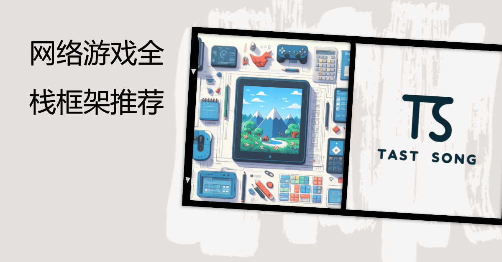

# full-stack-framework-recommendation
全栈架构推荐

# 零、序

在迅猛发展的游戏行业，精良的网络游戏架构是确保游戏顺畅运行和提供无缝玩家体验的关键要素。本文深入剖析游戏端、后端和服务端的各个层面，为游戏开发者提供了一个全面的视角，助力他们在设计过程中做出明智的决策。

**游戏端:** 我们将深入探讨Unity引擎下的游戏端，介绍DOTS（ECS）的强大性能优化，以及Game Framework、ET、QFramework等框架的独特特点。这将为开发者提供在构建游戏时选择最适合框架的依据。

**后台:** 在后台方面，我们将讨论Pure Admin和VUE Element Admin等后台框架，探索它们在开发中的便利性、灵活性以及与游戏前端的协同工作。

**服务端:** 对于服务端，我们将详细解释为何选择Laravel和Spring Boot等作为Web服务器，探讨它们在开发速度、性能和生态系统方面的优劣。同时，我们将深入研究Skynet和Rock GO游戏服务器的特性，帮助开发者了解它们在构建游戏服务器时的独特优势。

这篇文章将为游戏开发者提供深度洞察，使他们能够在项目中选择最适合的架构，实现高性能、高扩展性和令人印象深刻的游戏体验。随着技术的不断演进，我们将探索如何利用先进的网络游戏架构来塑造游戏行业的未来。

# 一、游戏端

## 1.1 DOTS（ECS）

### 1.1.1 原理分析

1. **DOTS概述：** DOTS（Data-Oriented Tech Stack）是一个多线程数据导向型技术堆栈，包含ECS（Entity Component System）、C# Job System和Burst Compiler。它通过ECS实现缓存友好、利用Job System进行多线程高效运算，再由Burst Compiler生成高度优化的本地代码。
2. **ECS原理：** ECS的核心是缓存友好的设计，利用结构体去掉垃圾回收。它通过将相同类型的组件在内存中排列在一起，利用Chunk和Archetype来提高数据访问效率。
3. **Job System原理：** Job System是用于编写高性能多线程代码的组件，充分利用多线程，提高运算效率。
4. **Burst Compiler：** Burst Compiler基于LLVM开发，利用SIMD指令优化，特别适用于大规模数学计算，如矩阵运算，提高运算速度。
5. **Hybrid Renderer：** Hybrid Renderer是为了适配ECS而开发的渲染系统，尽管在动画系统和蒙皮动画方面还存在一些限制，但在特定场景下能提供高效渲染。

### 1.1.2 应用

[Unity DOTS](https://github.com/Unity-Technologies/DOTS-training-samples)是一个官方的项目示例，该示例项目提供了一系列基于DOTS的训练样本，旨在帮助开发者学习和实践DOTS的使用。通过这些样本，你可以深入了解DOTS在不同场景下的应用，包括但不限于物理模拟、动画系统、多线程处理等。

*注意一定要使用对用版本的Unity打开，DOTS处于不断的迭代和发展之中，对应的Unity版本和依赖版本相对较为严格。*

### 1.1.3 优缺点

| 优势                                                         | 缺点                                                         |
| ------------------------------------------------------------ | ------------------------------------------------------------ |
| **卓越性能：** 通过ECS和Job System等组件，DOTS提供出色的性能，尤其在处理大规模数据时。 | **学习曲线：** 对于新手来说，学习DOTS可能需要一定的时间，尤其是理解ECS的概念和使用Job System等组件。 |
| **多线程优化：** Job System使得多线程编程变得更加容易，提高了游戏的并行处理能力。 | **渲染限制：** 在Hybrid Renderer中，对于动画和蒙皮动画的支持仍然不够完善，可能需要在某些方面使用传统渲染。 |
| **Burst Compiler优化：** 使用Burst Compiler生成高度优化的本地代码，提高运行效率。 | **不适用于所有项目：** DOTS更适用于大规模相同单位运算的项目，对于一些简单游戏而言，引入DOTS可能显得过于复杂。 |
| **适用于数学计算：** DOTS通过SIMD指令优化数学运算，特别适用于处理大规模数学计算。 | **版本迭代：** DOTS在不断迭代中，可能会导致接口和功能的变动，需要保持关注最新版本。 |

### 1.1.4 适用场景

1. 大规模相同物体的运算

   DOTS在处理大量相同物体的运算时展现出色的性能。对于类似红警等战略游戏，可能存在大量相同类型的单位或建筑，这些单位需要进行雷同运算，如移动、攻击等。DOTS通过其缓存友好的设计和多线程优化，能够高效地处理这些大规模的运算，从而提供卓越的性能。

2. 学习成本高但值得投入

   尽管DOTS的学习曲线相对较高，但在特定项目中，尤其是在需要处理大规模数据和实现高性能的场景下，对其进行投入可能是值得的。在类似战略游戏的复杂性和性能需求下，通过理解和使用DOTS，开发者能够获得更高效、更可维护的代码结构。

3. 已有项目不建议升级

   对于已经成型的项目，特别是那些不具备大规模相同物体运算需求的项目，引入DOTS可能并不切实际。由于DOTS仍在不断迭代，项目升级到DOTS可能导致较高的迁移成本，并且并非所有项目都能从DOTS中获得显著的性能提升。因此，在项目已经成熟的情况下，不建议升级到DOTS。

4. 独立开发

   DOTS（Data-Oriented Tech Stack）在特定情境下，尤其是独立开发者考虑使用Unity的云服务代理Netcode时，也是一个极具吸引力的选择。Unity的Netcode是一个用于构建多人联网游戏的云服务代理，它旨在简化多人游戏的开发和部署。当你的游戏需要支持多人联机，并且你计划使用Unity的Netcode服务时，DOTS可以作为一个优秀的游戏端框架。

## 2.1 GameFramework

### 2.1.1 框架概述

[GameFramework](https://github.com/EllanJiang/GameFramework)是一个开源的Unity游戏开发框架，旨在帮助开发者更高效地构建游戏项目。该框架提供了一系列功能模块，包括事件管理、资源加载、对象池、流程管理等，以简化游戏开发中常见的任务，使开发者能够更专注于游戏逻辑的实现。

### 2.1.2 主要功能和原理

1. **模块化设计：** GameFramework采用模块化设计，将不同功能划分为独立的模块，如事件管理、资源加载等。这种设计使得开发者能够根据项目需求选择性地使用框架提供的功能，提高了框架的灵活性。
2. **事件管理：** 提供了事件系统，用于处理游戏中各种事件的发布和监听。通过事件管理，开发者能够实现不同模块之间的松耦合通信，增强代码的可维护性。
3. **资源加载：** GameFramework包含了资源加载模块，用于管理和加载游戏中的各类资源。通过资源加载模块，开发者可以方便地进行资源加载和卸载，提高游戏的性能和效率。
4. **对象池：** 提供了对象池功能，用于管理游戏中的对象实例，以减少对象的创建和销毁开销。对象池能够有效地重用对象，提高游戏性能。
5. **流程管理：** GameFramework引入了流程管理的概念，用于管理游戏的各个阶段或状态。通过流程管理，开发者可以更容易地组织游戏的逻辑结构，实现游戏状态的切换和管理。

### 2.1.3 优缺点

| 优势                                                         | 缺点                                                         |
| ------------------------------------------------------------ | ------------------------------------------------------------ |
| **模块化设计：** 框架采用模块化设计，使得开发者能够根据项目需求选择性地使用不同功能模块，提高了框架的灵活性。 | **社区活跃度：** 相对于一些主流游戏框架，GameFramework的社区活跃度可能较低，可能导致获取支持和解决问题的速度较慢。 |
| **事件管理：** 提供了事件系统，有助于实现模块之间的解耦通信，增强了代码的可维护性。 | **学习曲线：** 对于新手来说，框架的学习曲线可能较陡峭，需要花一定时间熟悉和掌握框架的各个模块。 |
| **资源加载：** 拥有资源加载模块，方便管理和加载游戏中的各类资源，提高了游戏的性能和效率。 | **框架规模：** 相较于一些大型游戏引擎提供的完整解决方案，GameFramework的功能可能相对有限，适用于一些中小型项目。 |
| **对象池：** 提供了对象池功能，能够有效地重用对象，降低对象创建和销毁的性能开销。 | **文档完整性：** 框架的文档可能相对较少，可能需要依赖源码和示例项目进行更深入的了解。 |
| **流程管理：** 引入了流程管理的概念，有助于更容易地组织游戏的逻辑结构，实现游戏状态的切换和管理。 |                                                              |

### 2.1.4 适用场景

GameFramework适用于中小型游戏项目，特别是那些对框架模块化设计、事件管理、资源加载和对象池等功能有需求的项目。以下是适用场景的一些示例：

1. **小型独立开发项目：** 对于小型独立开发者，GameFramework提供了一套相对完整的框架，能够帮助项目更快速地搭建起来。
2. **中小型团队开发：** 适用于中小型团队开发的项目，框架提供的模块化设计和流程管理有助于团队更好地协作。
3. **有一定经验的开发者：** 针对有一定游戏开发经验的开发者，学习和使用GameFramework能够提高项目的开发效率。

总的来说，GameFramework作为一个轻量级的Unity游戏开发框架，适用于一些对框架功能需求较为简单的中小型项目。

##  3.1  ET 

### 3.1.1 框架概述

[ET](https://github.com/egametang/ET)是一款基于C#语言开发的游戏服务器框架，旨在简化多人在线游戏的开发。ET框架采用Entity-Component-System（ECS）架构，具有热更支持、Actor模型和分布式服务器等特性。

### 3.1.2 主要功能和原理

1. **Entity-Component-System（ECS）架构：** ET框架采用ECS架构，将游戏对象分解成实体（Entity）和组件（Component），并通过系统（System）管理它们的行为。这提高了代码的可维护性和可扩展性。
2. **热更支持：** ET支持热更功能，允许在运行时更新游戏逻辑代码，无需停服。这有助于提高游戏的运维效率和灵活性。
3. **Actor 模型：** 引入Actor模型，将每个玩家、怪物等实体都看作一个独立的Actor，通过消息传递进行通信。这简化了并发编程，减少了锁的使用。
4. **分布式服务器：** ET支持分布式部署，通过Actor模型和分布式部署，能够构建出高可用性和高性能的多人在线游戏服务器集群。

### 3.1.3 优缺点

| 优势                                                         | 缺点                                                         |
| ------------------------------------------------------------ | ------------------------------------------------------------ |
| **ECS架构：** 提高了代码的可维护性和可扩展性，使得游戏服务器逻辑更加清晰。 | **学习曲线：** 对于新手来说，理解和掌握ECS架构可能需要一定的学习成本。 |
| **热更支持：** 允许在运行时更新游戏逻辑代码，提高了游戏的运维效率。 | **社区支持：** 相对于一些主流游戏框架，ET框架的社区相对较小，可能导致获取支持的速度较慢。 |
| **Actor模型：** 简化了并发编程，减少了锁的使用，有助于处理多玩家同时操作的情况。 | **热更稳定性：** 在一些特定场景下，热更功能可能面临一些稳定性的挑战，需要谨慎使用。 |
| **分布式部署：** 能够构建出高可用性和高性能的多人在线游戏服务器集群。 | **文档完整性：** 框架的文档相对较少，可能需要依赖源码和示例项目进行更深入的了解。 |

### 3.1.4 适用场景

ET框架适用于中大型多人在线游戏项目，特别是那些对服务器性能和可维护性要求较高的项目。以下是适用场景的一些示例：

1. **多人在线游戏项目：** 由于ET框架采用了Actor模型和分布式部署，适用于构建大规模的多人在线游戏服务器。
2. **对服务器性能要求高的项目：** 采用ECS架构和Actor模型，ET框架能够有效地处理多玩家同时操作的情况，适用于对服务器性能要求较高的项目。
3. **需要热更支持的项目：** ET框架提供了热更功能，适用于需要在运行时更新游戏逻辑代码而无需停服的项目。
4. **分布式服务器集群：** 通过支持分布式部署，ET框架能够构建出高可用性和高性能的服务器集群，适用于对服务器架构要求较高的项目。

总体来说，ET框架是一个专注于多人在线游戏服务器开发的框架，适用于一些大规模和对性能要求高的游戏项目。

